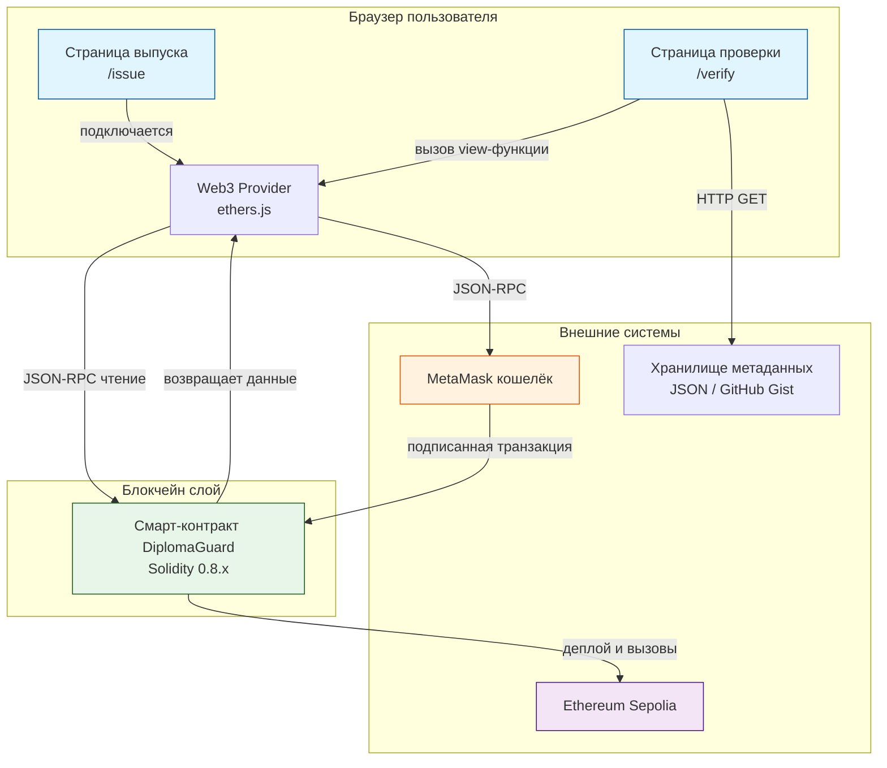

# Контейнерная архитектура DiplomaGuard (C4 - уровень 2)

## Диаграмма контейнеров

## Компоненты и их обязанности

| Компонент | Технология | Обязанность |
|-----------|------------|-------------|
| **Frontend (страница выпуска)** | HTML/JS + ethers.js | Форма для админа, подключение к MetaMask, отправка транзакции |
| **Frontend (страница проверки)** | HTML/JS + ethers.js | Поле ввода ID, вызов view-функции контракта, отображение результата |
| **MetaMask** | Внешнее расширение | Подпись транзакций, управление приватными ключами |
| **Смарт-контракт** | Solidity 0.8.x | Хранение данных о дипломах, проверка прав эмитента, логика верификации |
| **Хранилище метаданных** | JSON (HTTP) | Хранение подробной информации о дипломе (ФИО, оценки и т.д.) |

## Связи между контейнерами

| От | К | Протокол | Данные |
|----|---|----------|--------|
| Страница выпуска | MetaMask | JSON-RPC | Транзакция выпуска |
| MetaMask | Смарт-контракт | JSON-RPC | Подписанная транзакция |
| Страница проверки | Смарт-контракт | JSON-RPC (view) | Запрос верификации |
| Страница проверки | Хранилище метаданных | HTTP GET | JSON с данными диплома |

## Почему такая архитектура?

| Решение | Причина |
|---------|---------|
| Только фронтенд + смарт-контракт | Нет необходимости в бэкенде (блокчейн сам сервер) |
| MetaMask для выпуска | Безопасное управление ключами, готовое решение |
| Отдельное хранилище для метаданных | Экономия газа (данные не в блокчейне) |
| Две отдельные страницы | Разделение ролей: админ (с кошельком) и HR (без кошелька) |