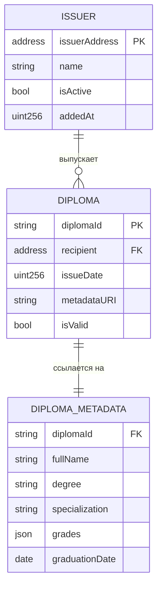
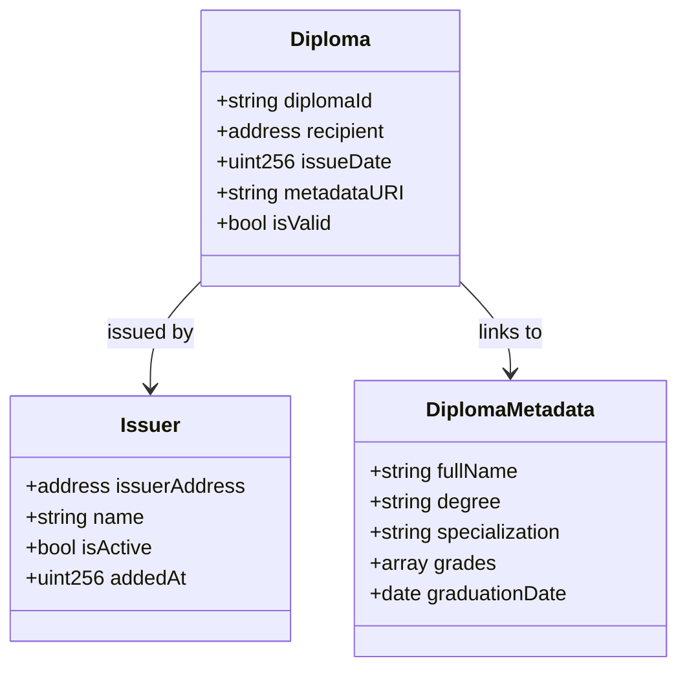

# Модель данных DiplomaGuard

## 1. Основные сущности предметной области

| Сущность | Описание | Где хранится |
|----------|----------|--------------|
| **Diploma** | Информация о дипломе (ID, владелец, дата выдачи) | Смарт-контракт |
| **Issuer** | Вуз или организация, которая может выпускать дипломы | Смарт-контракт |
| **DiplomaMetadata** | Подробные данные диплома (ФИО, оценки, специальность) | JSON-файл (внешнее хранилище) |
| **DiplomaEvent** | Событие о выпуске диплома | Событие смарт-контракта |

## 2. Модель данных смарт-контракта

### Структуры (Structs) в Solidity

```solidity
struct Diploma {
    address recipient;      // Ethereum-адрес студента
    uint256 issueDate;      // Дата выдачи (timestamp)
    string metadataURI;     // Ссылка на JSON с данными
    bool isValid;           // Флаг действительности
}

struct Issuer {
    address issuerAddress;  // Адрес кошелька вуза
    string name;            // Название вуза
    bool isActive;          // Активен ли (может выпускать)
    uint256 addedAt;        // Дата добавления
}
```

### Маппинги (Mappings)

```solidity
mapping(string => Diploma) public diplomas;
mapping(address => Issuer) public issuers;
string[] public diplomaIds;
address[] public issuerAddresses;
```

### События (Events)

```solidity
event DiplomaIssued(
    string indexed diplomaId,
    address indexed recipient,
    address indexed issuer,
    uint256 issueDate,
    string metadataURI
);

event IssuerAdded(
    address indexed issuerAddress,
    string name,
    address addedBy
);
```

## 3. Модель метаданных диплома (JSON)

```json
{
    "diplomaId": "DIP-2026-001",
    "version": "1.0",
    "student": {
        "fullName": "Иван Алексеевич Петров",
        "dateOfBirth": "2000-05-15",
        "studentId": "STU-2020-12345"
    },
    "diplomaInfo": {
        "degree": "Бакалавр",
        "specialization": "Программная инженерия",
        "qualification": "Инженер-программист",
        "honors": true
    },
    "university": {
        "name": "Технический университет",
        "faculty": "Информационных технологий",
        "city": "Москва"
    },
    "grades": [
        {"subject": "Алгоритмы и структуры данных", "grade": "Отлично", "credits": 5},
        {"subject": "Базы данных", "grade": "Хорошо", "credits": 4},
        {"subject": "Web-разработка", "grade": "Отлично", "credits": 5}
    ],
    "graduationDate": "2026-06-30",
    "diplomaNumber": "ВСБ 1234567"
}
```

## 4. ER-диаграмма



## 5. Ограничения модели данных

| Ограничение | Значение | Причина |
|-------------|----------|---------|
| Макс. длина diplomaId | 64 символа | Ограничение строк в Solidity |
| diplomaId уникальный | enforced by contract | Нельзя выпустить два одинаковых |
| Только issuer может выпускать | модификатор onlyIssuer | Безопасность |
| metadataURI доступен по HTTP | требование | Чтобы HR видел детали |
| Размер JSON | < 1 MB | Время загрузки |

## 6. Примеры данных

### Данные в смарт-контракте

```
diplomas["DIP-2026-001"] = {
    recipient: "0x742d35Cc6634C0532925a3b844Bc9e7595f0b367",
    issueDate: 1704067200,
    metadataURI: "https://gist.github.com/diploma-001.json",
    isValid: true
}
```

### Запись об эмитенте

```
issuers["0xAdminAddress123..."] = {
    issuerAddress: "0xAdminAddress123...",
    name: "Технический университет",
    isActive: true,
    addedAt: 1700000000
}
```

## 7. Диаграмма классов



## 8. Сценарии использования данных

### Выпуск диплома

1. Админ вызывает `issueDiploma(recipient, diplomaId, metadataURI)`
2. Контракт проверяет `issuers[msg.sender].isActive == true`
3. Создаётся запись в `diplomas[diplomaId]`
4. Генерируется событие `DiplomaIssued`

### Проверка диплома

1. HR вызывает `verifyDiploma(diplomaId)` (view-функция)
2. Контракт читает `diplomas[diplomaId]`
3. Возвращает `(isValid, recipient, issueDate)`
4. Фронтенд загружает `metadataURI` и показывает детали