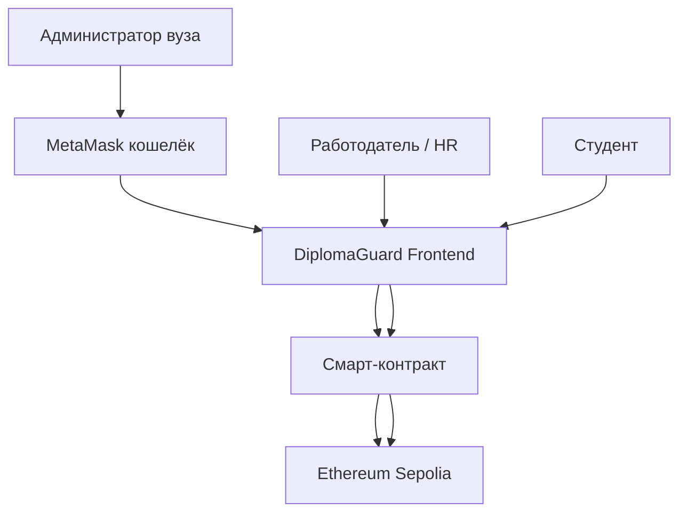

# Системный контекст DiplomaGuard (C4 - уровень 1)

## Диаграмма контекста

## Описание участников

| Участник | Роль | Взаимодействие с системой |
|----------|------|---------------------------|
| **Администратор (вуз)** | Выпускает дипломы | Подключает MetaMask → заполняет форму → подписывает транзакцию |
| **Студент** | Владелец диплома | Получает ID диплома → может поделиться ссылкой |
| **Работодатель (HR)** | Проверяет дипломы | Вводит ID на сайте → получает результат без регистрации |
| **MetaMask** | Внешний кошелёк | Подписывает транзакции выпуска |
| **Ethereum Sepolia** | Внешний блокчейн | Хранит смарт-контракт и данные о дипломах |

## Интерфейсы взаимодействия

| От | К | Тип | Данные | Частота |
|----|---|-----|--------|---------|
| Админ | DiplomaGuard (фронт) | HTTP | Форма с данными диплома | Редко (выпуск) |
| DiplomaGuard (фронт) | MetaMask | JSON-RPC | Транзакция | Редко |
| MetaMask | Смарт-контракт | JSON-RPC | Подписанная транзакция | Редко |
| HR | DiplomaGuard (фронт) | HTTP | GET /verify/{id} | Часто |
| DiplomaGuard (фронт) | Смарт-контракт | JSON-RPC | Вызов view-функции | Часто |

## Объёмы данных и нагрузка

| Параметр | Значение |
|----------|----------|
| Выпусков в день (максимум) | 100 |
| Проверок в день (максимум) | 10 000 |
| Размер транзакции выпуска | ~200 bytes |
| Размер ответа проверки | ~500 bytes |
| Пиковая нагрузка (в час) | 1000 проверок |