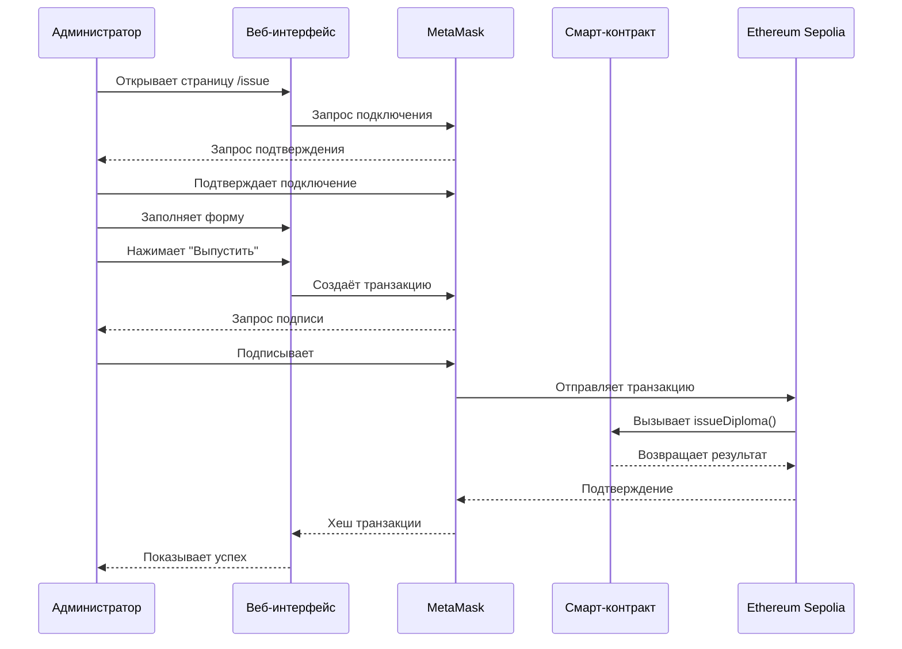
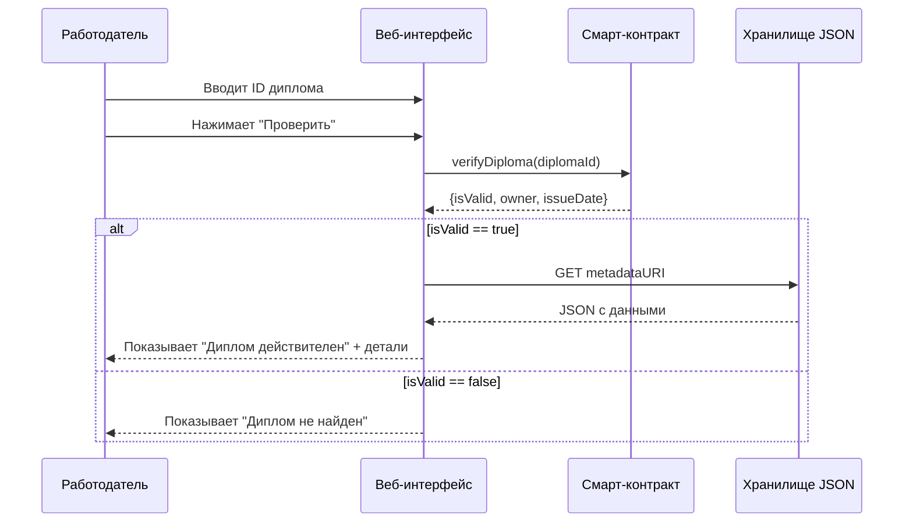
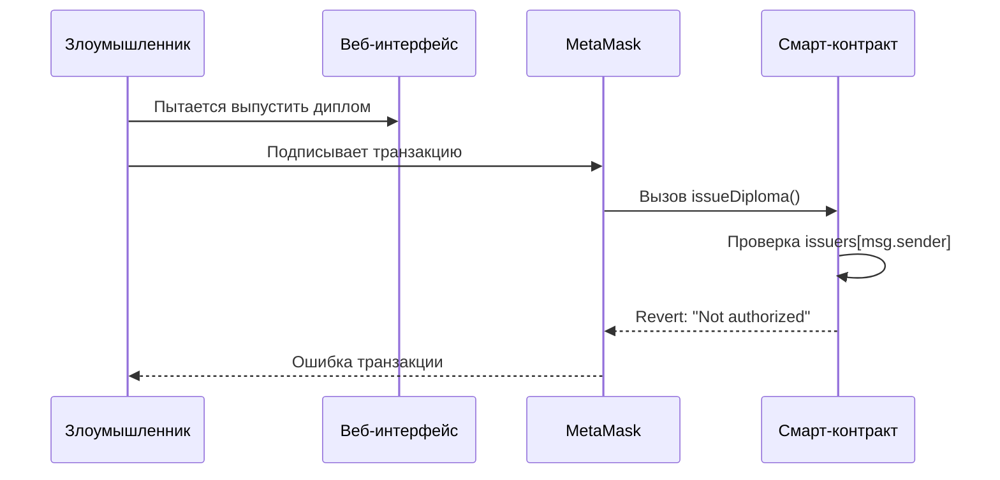
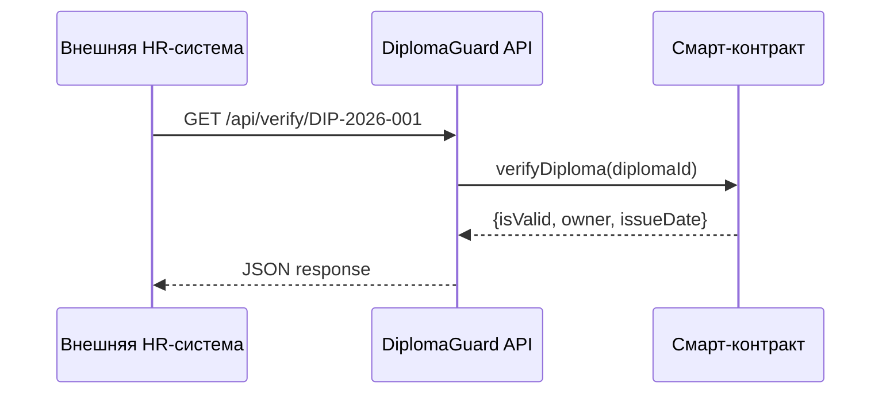
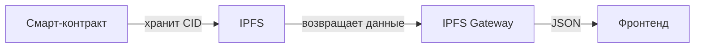

# Сценарии использования DiplomaGuard

## 1. Основные сценарии

### Сценарий 1: Успешный выпуск диплома

| Шаг | Действие | Участник | Результат |
|-----|----------|----------|-----------|
| 1 | Администратор открывает страницу `/issue` | Вуз | Загружается форма |
| 2 | Подключает MetaMask (если не подключён) | Вуз | Появляется адрес кошелька |
| 3 | Заполняет форму: адрес студента, ID диплома, ссылка на JSON | Вуз | Данные валидируются |
| 4 | Нажимает "Выпустить диплом" | Вуз | MetaMask запрашивает подпись |
| 5 | Подтверждает транзакцию | Вуз | Транзакция отправлена в сеть |
| 6 | Ожидает подтверждения (15-30 сек) | Вуз | Статус "Processing..." |
| 7 | Получает подтверждение | Вуз | Показывается хеш транзакции и ссылка на диплом |

**Альтернативные потоки:**

| Ситуация | Результат |
|----------|-----------|
| Админ не авторизован (не в списке issuers) | Транзакция отклоняется с ошибкой "Not authorized" |
| Диплом с таким ID уже существует | Ошибка "Diploma already issued" |
| Недостаточно газа для транзакции | MetaMask показывает ошибку, транзакция не отправляется |

### Сценарий 2: Проверка диплома (HR)

| Шаг | Действие | Участник | Результат |
|-----|----------|----------|-----------|
| 1 | HR открывает главную страницу | HR | Видит поле ввода ID диплома |
| 2 | Вводит ID диплома (например, DIP-2026-001) | HR | Нажимает "Проверить" |
| 3 | Фронтенд вызывает `verifyDiploma` через ethers.js | Система | Контракт возвращает данные |
| 4 | Система загружает метаданные по `metadataURI` | Система | Получает JSON с деталями |
| 5 | Отображает результат | HR | Зелёная карточка "Диплом действителен" |
| 6 | Показывает ФИО, специальность, вуз, дату выдачи | HR | Полная информация о дипломе |

**Альтернативные потоки:**

| Ситуация | Результат |
|----------|-----------|
| Диплом не найден в контракте | Красная карточка "Диплом не найден" |
| Диплом отозван (`isValid = false`) | Красная карточка "Диплом аннулирован" |
| Метаданные недоступны (HTTP 404) | Показывается только базовая информация из контракта |

### Сценарий 3: Добавление нового вуза-эмитента

| Шаг | Действие | Участник | Результат |
|-----|----------|----------|-----------|
| 1 | Владелец контракта открывает админ-панель | Admin | Специальная страница |
| 2 | Вводит адрес кошелька нового вуза | Admin | Поле для ввода |
| 3 | Вводит название вуза | Admin | Текстовое поле |
| 4 | Нажимает "Добавить эмитента" | Admin | Подписывает транзакцию |
| 5 | Транзакция подтверждена | Admin | Вуз добавлен в список issuers |

## 2. Диаграммы последовательности

### Диаграмма: Выпуск диплома

### Диаграмма: Проверка диплома

## 3. Сценарии с ошибками

### Сценарий 4: Ошибка при выпуске — неавторизованный админ

### Сценарий 5: Ошибка при проверке — метаданные недоступны

| Шаг | Действие | Результат |
|-----|----------|-----------|
| 1 | Диплом существует в контракте | `isValid == true` |
| 2 | Ссылка `metadataURI` ведёт на несуществующий файл | HTTP 404 |
| 3 | Фронтенд показывает базовую информацию | "Диплом действителен, детали недоступны" |

### Сценарий 6: Ошибка сети — пользователь офлайн

| Шаг | Действие | Результат |
|-----|----------|-----------|
| 1 | Пользователь открывает страницу проверки | Страница загружена (из кеша) |
| 2 | Пытается проверить диплом | Нет соединения с Ethereum RPC |
| 3 | Фронтенд показывает ошибку | "Не удалось подключиться к сети. Проверьте интернет." |

## 4. Сценарии предполагаемого развития системы

### Версия 1.1: API для внешних систем

**Что добавляется:**
- REST API для интеграции с HR-платформами
- API-ключи для ограничения запросов
- Webhooks при выпуске новых дипломов

### Версия 1.2: Массовый выпуск дипломов

| Функция | Описание |
|---------|----------|
| Загрузка CSV | Админ загружает файл со списком дипломов |
| Пакетная обработка | Контракт выпускает несколько дипломов за одну транзакцию |
| Прогресс-бар | Отображение статуса обработки |
| Скачивание отчёта | CSV с результатами выпуска |

### Версия 2.0: Основная сеть Ethereum

| Изменение | Причина |
|-----------|---------|
| Деплой на Mainnet | Реальная неизменяемость, настоящая ценность |
| Оптимизация газа | Сокращение стоимости выпуска (цель < $5) |
| Аудит смарт-контракта | Безопасность для production |
| Страхование газа | Опция для вузов фиксировать стоимость |

### Версия 2.1: IPFS для метаданных

**Преимущества:**
- Децентрализованное хранение метаданных
- Нет зависимости от одного сервера
- Контент адресуется по хешу (неизменяемость)

### Версия 3.0: DID и Verifiable Credentials

| Компонент | Описание |
|-----------|----------|
| DID (Decentralized Identifier) | У каждого студента и вуза свой DID |
| Verifiable Credentials | Диплом как криптографически подписанный JSON-LD |
| Zero-knowledge proofs | Проверка диплома без раскрытия личных данных |
| Revocation registry | Децентрализованный реестр отозванных дипломов |

## 5. Матрица трассировки сценариев

| Сценарий | Функциональные требования | Модель данных | Компоненты |
|----------|--------------------------|---------------|------------|
| Выпуск диплома | FR-01, FR-02, FR-06 | Diploma, Issuer | Смарт-контракт, страница /issue, MetaMask |
| Проверка диплома | FR-03, FR-04, FR-05 | Diploma, DiplomaMetadata | Смарт-контракт, страница /verify |
| Добавление эмитента | FR-06 | Issuer | Смарт-контракт |
| Неавторизованный выпуск | FR-06 | Issuer | Смарт-контракт |
| Ошибка метаданных | FR-05 | DiplomaMetadata | Фронтенд |
| Массовый выпуск (будущее) | FR-07 | Diploma | API, бэкенд |

## 6. Заключение

Основные сценарии DiplomaGuard покрывают:

1. **Выпуск диплома** — ключевая функция для вузов
2. **Проверка диплома** — ключевая функция для работодателей
3. **Управление эмитентами** — административная функция

Система устойчива к ошибкам:
- Неавторизованный доступ блокируется на уровне смарт-контракта
- Недоступность метаданных не ломает базовую проверку
- Офлайн-режим обрабатывается с понятными сообщениями

Планируемое развитие:
- API для автоматизации
- Массовый выпуск
- Основная сеть Ethereum
- IPFS и децентрализация
- DID и Verifiable Credentials